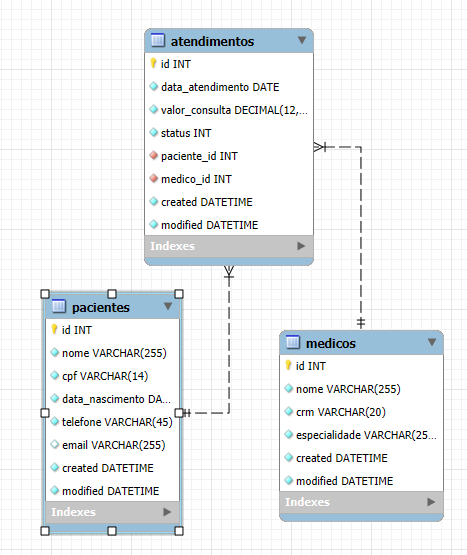
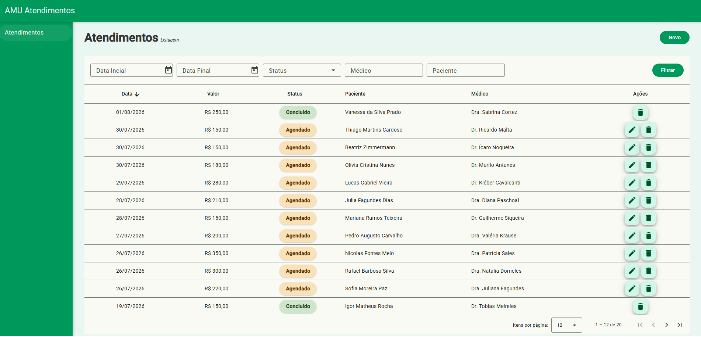
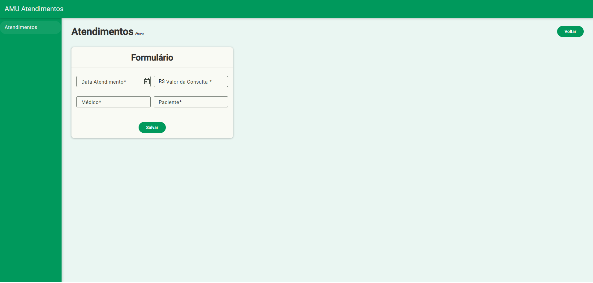
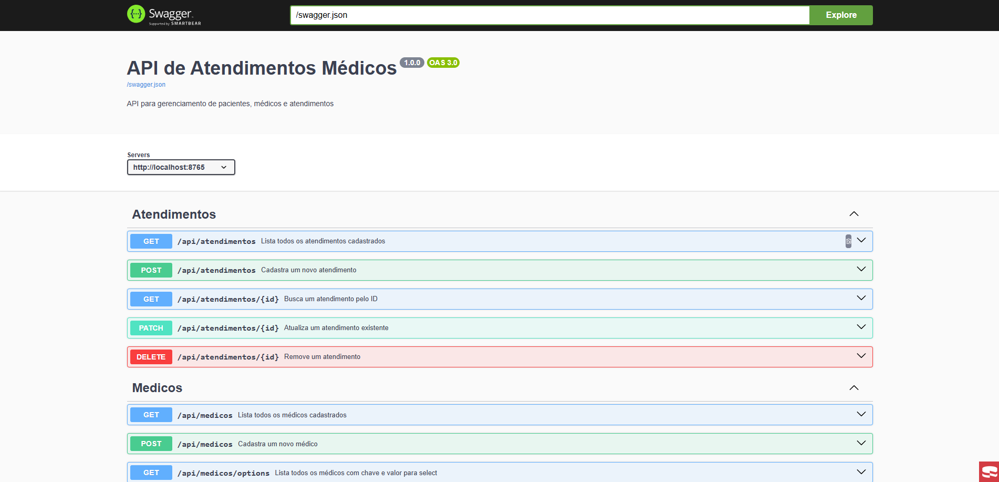

# 🏥 AMU Atendimentos - Sistema de Atendimento Médico

Aplicação desenvolvida como solução para o desafio técnico proposto, contemplando uma API REST construída com CakePHP e uma interface web desenvolvida em Angular.

---

# 📋 Sumário

- [Sobre o Projeto](#-sobre-o-projeto)
- [Tecnologias Utilizadas](#-tecnologias-utilizadas)
- [Arquitetura](#-arquitetura)
- [Estrutura do Projeto](#-estrutura-do-projeto)
- [Banco de Dados](#-banco-de-dados)
- [Backend (API)](#-backend-api)
- [Frontend](#-frontend)
- [Diferenciais Implementados](#-diferenciais-implementados)
- [Executando Projeto](#-executando-projeto)
- [Acessos](#-acessos)
- [Documentação da API](#-documentação-da-api)
- [Testes](#-testes)
- [Integração Contínua](#-integração-contínua)
- [Melhorias Futuras](#-melhorias-futuras)
- [Autor](#-autor)

---

# 📖 Sobre o Projeto

O sistema tem como objetivo realizar o gerenciamento de atendimentos médicos, permitindo o cadastro e consulta de pacientes, médicos e atendimentos.

A solução foi construída seguindo boas práticas de arquitetura, separação de responsabilidades e organização de código.

---

# 📑 Tecnologias Utilizadas

## Backend

- PHP 8.x
- CakePHP 5
- MySQL 8
- Swagger/OpenAPI
- PHPUnit

## Frontend

- Angular 22
- TypeScript
- RxJS
- Angular Router

## Infraestrutura

- Docker
- Docker Compose
- GitHub Actions

---

# 🏗 Arquitetura

## Backend

A API segue arquitetura em camadas:

```text
Controller
    ↓
Service
    ↓
Repository
```

### Controller

Responsável por:

- Receber requisições HTTP
- Retornar respostas HTTP
- Consumir Services

### Service

Responsável por:

- Regras de negócio
- Validações
- Tratamento de exceções
- Transformação de dados

### Repository

Responsável por:

- Consultas
- Persistência
- Acesso ao banco

---

## Frontend

O frontend foi organizado utilizando Feature Based Architecture.

```text
core...
seature
 ├─ pages
 ├─ services
 ├─ models
 ├─ validators
 ├─ constants
 └─ mappers
shared...
```

---

# 📂 Estrutura do Projeto

```text
.
├── backend
|   |...
│   ├── config
│   ├── logs
│   ├── src
│   │   ├── Controller
│   │   ├── Service
│   │   ├── Repository
│   │   ├── Middleware
│   │   ├── Error
│   │   └── Model
│   |── tests
|   └...
│
├── frontend
│   └── src
│       └── app
│           ├── core
│           ├── features
│           └── shared
│
├── docker-compose.yml
└── README.md
```

---

# 🗄 Banco de Dados

## DER

> Inserir imagem do DER



### Relacionamentos

- Um paciente possui vários atendimentos
- Um médico possui vários atendimentos
- Um atendimento pertence a um paciente
- Um atendimento pertence a um médico

---

# 🔌 Backend (API)

## Recursos Disponíveis

### Pacientes

| Método | Endpoint |
|----------|----------|
| GET | /api/pacientes |
| GET | /api/pacientes/{id} |
| POST | /api/pacientes |
| PUT | /api/pacientes/{id} |
| DELETE | /api/pacientes/{id} |

### Médicos

| Método | Endpoint |
|----------|----------|
| GET | /api/medicos |
| GET | /api/medicos/{id} |
| POST | /api/medicos |
| PUT | /api/medicos/{id} |
| DELETE | /api/medicos/{id} |

### Atendimentos

| Método | Endpoint |
|----------|----------|
| GET | /api/atendimentos |
| GET | /api/atendimentos/{id} |
| POST | /api/atendimentos |
| PUT | /api/atendimentos/{id} |
| DELETE | /api/atendimentos/{id} |

---

## Recursos Adicionais

### Paginação

```http
GET /api/atendimentos?page=1&limit=10
```

### Ordenação

```http
GET /api/atendimentos?sort=data_atendimento&direction=desc
```

### Busca

```http
GET /api/atendimentos?paciente=joao
```

---

# 🎨 Frontend

Atualmente o frontend contempla o módulo de Atendimentos.

## Rotas

| Rota                     | Descrição                |
|--------------------------|--------------------------|
| /atendimentos            | Listagem de atendimentos |
| /atendimentos/novo       | Cadastro de atendimento  |
| /atendimentos/editar/:id | Edição de atendimento    |

## Funcionalidades

### Listagem de Atendimentos



A tela permite:

- Busca de atendimentos
- Paginação
- Ordenação
- Exclusão

### Cadastro de Atendimento



Formulário com:

- Seleção de paciente
- Seleção de médico
- Data do atendimento
- Valor da consulta
- Validações

---

# ⭐ Diferenciais Implementados

- Docker
- Docker Compose
- Migrations
- Seeders
- Swagger/OpenAPI
- Paginação
- Busca
- Ordenação
- Logs
- Testes Automatizados
- GitHub Actions
- Tratamento Global de Exceções
- Arquitetura em Camadas
- ORM

---

# 🚀 Executando Projeto

## 1. Clonar o repositório

```bash
git clone https://github.com/GustavoAlbonico/desafio-tecnico.git
```

```bash
cd desafio-tecnico
```

---

## 2. Subir a aplicação

Execute: 

```bash
docker compose up -d --build 
```
> A primeira execução pode levar alguns minutos, pois as imagens Docker precisam ser construídas e as dependências instaladas.

Esse comando irá:

- Construir as imagens Docker
- Criar os containers da aplicação
- Criar o banco de dados
- Executar automaticamente as migrations
- Executar automaticamente os seeders
- Disponibilizar o backend e frontend para acesso

---

## 3. Verificar containers

```bash
docker compose ps
```

Todos os serviços devem estar com status **running**.
---

# 🌐 Acessos

| Serviço | URL |
|----------|----------|
| Frontend | http://localhost:4200                  |
| API      | http://localhost:8765/api/atendimentos |
| Swagger  | http://localhost:8765/swagger          |

---

# 📚 Documentação da API



A documentação completa está disponível em:

```text
http://localhost:8765/swagger
```

---

# 🧪 Testes

Executar os testes automatizados:

```bash
docker compose exec backend php vendor/bin/phpunit
```

---

# 🔄 Integração Contínua

O projeto possui pipeline automatizada utilizando GitHub Actions.

Validações executadas:

- Instalação de dependências
- Execução dos testes automatizados
- Build da aplicação

---

# 📈 Melhorias Futuras

Embora o projeto atenda aos requisitos propostos, algumas evoluções que poderiam ser implementadas em uma próxima etapa seriam:

- Autenticação via JWT.
- Controle de permissões por perfil de usuário.
- Controle de visualização com base na permisão do usuário no frontend.
- Mensageria avisando sobre os agendamentos.
- CD com github actions.

---

# 👨‍💻 Autor

Gustavo Albônico Gonçalves